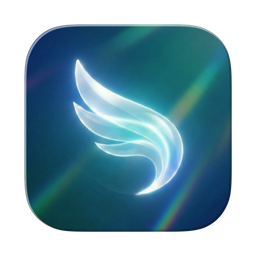

English | [日本語](README.ja.md)

# Sessylph

<p align="center">
  
  <br>
  A native macOS wrapper for <a href="https://docs.anthropic.com/en/docs/claude-code">Claude Code</a> and Codex CLI with tabbed terminal sessions, tmux persistence, and desktop notifications.
</p>

## Features

- **Tabbed Interface** — Each tab runs an independent Claude Code or Codex session using native macOS window tabbing
- **tmux Persistence** — Sessions survive app restarts; reconnect to running conversations with scrollback history preserved
- **Session History** — Resume recent Claude Code and Codex sessions directly from the launcher
- **Desktop Notifications** — Get notified when Claude Code completes a task or when Codex hands the turn back to you
- **Auto-Activate** — Optionally bring the app and tab to front when a task completes
- **Image Paste** — Paste images directly into the terminal with Cmd+V
- **Configurable** — Customize CLI type, model, approval mode, appearance, and behavior via Settings

## Requirements

- macOS 15.0 (Sequoia) or later
- At least one supported CLI installed:
  [Claude Code](https://docs.anthropic.com/en/docs/claude-code) or Codex CLI
- [tmux](https://github.com/tmux/tmux) installed

---

## Development

### Architecture

```
User opens new tab
        ↓
  LauncherView (pick CLI + directory + options)
        ↓
  TmuxManager.createAndLaunchSession()  ← single tmux invocation
        ↓
  TerminalViewController (GhosttyKit/Metal attaches to tmux)

Notifications:
  Claude Code hook / Codex notify → sessylph-notifier CLI
        ↓
  DistributedNotificationCenter
        ↓
  NotificationManager → UNUserNotificationCenter
```

See [ARCHITECTURE.md](docs/ARCHITECTURE.md) for detailed internal documentation.

### Requirements

- Xcode 16.0+
- [XcodeGen](https://github.com/yonaskolb/XcodeGen)

### Build from Source

```bash
git clone https://github.com/Saqoosha/Sessylph.git
cd Sessylph
xcodegen generate
xcodebuild -scheme Sessylph -configuration Debug -derivedDataPath build build

# The app is located at:
# build/Build/Products/Debug/Sessylph.app
```

### Build Commands

```bash
xcodegen generate                                                          # Generate Xcode project
xcodebuild -scheme Sessylph -configuration Debug -derivedDataPath build build   # Debug build
/usr/bin/python3 scripts/generate_icon.py                                  # Regenerate app icons
```

### Project Structure

```
Sources/
├── Sessylph/              # Main app (AppKit + SwiftUI)
│   ├── App/               # AppDelegate, entry point
│   ├── Launcher/          # Directory picker + options (SwiftUI)
│   ├── Models/            # Session, LaunchConfig, Claude/Codex options + history
│   ├── Notifications/     # Hook integration + desktop notifications
│   ├── Settings/          # Preferences window (SwiftUI)
│   ├── Tabs/              # TabManager, TabWindowController
│   ├── Terminal/          # GhosttyKit terminal view (Metal)
│   ├── Tmux/              # tmux session management
│   └── Utilities/         # CLI resolvers, environment, helpers
└── SessylphNotifier/      # Bundled CLI for hook → notification bridge
```

## Third-Party Libraries

- [GhosttyKit (libghostty)](https://github.com/ghostty-org/ghostty) — Terminal emulator library with Metal GPU rendering

## License

MIT
