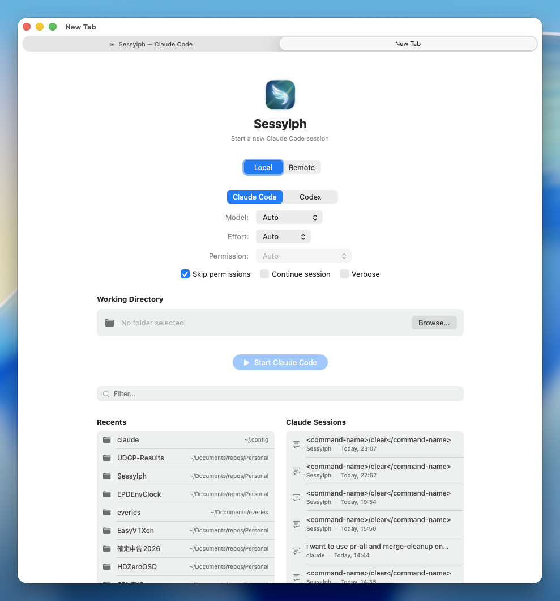

English | [日本語](README.ja.md)

# Sessylph

<p align="center">
  
  <br>
  A native macOS wrapper for <a href="https://docs.anthropic.com/en/docs/claude-code">Claude Code</a> and Codex CLI with tabbed terminal sessions, tmux persistence, and desktop notifications.
</p>

<p align="center">
  
</p>

## Features

- **Tabbed Interface** — Each tab runs an independent Claude Code or Codex session using native macOS window tabbing
- **tmux Persistence** — Sessions survive app restarts; reconnect to running conversations with scrollback history preserved
- **Remote SSH Sessions** — Connect to remote hosts and run Claude Code over SSH with directory browsing and session history
- **Session History** — Resume recent Claude Code and Codex sessions directly from the launcher, including remote host:directory pairs
- **Desktop Notifications** — Get notified when Claude Code completes a task (local via hooks, remote via title polling) or when Codex hands the turn back to you
- **Auto-Activate** — Optionally bring the app and tab to front when a task completes
- **Image Paste** — Paste images directly into the terminal with Cmd+V
- **Command Strip** — Slash commands and free-text phrases are automatically detected and displayed as shortcut buttons at the bottom of the terminal; click to re-execute instantly, sorted by most recently used. Manually add commands via the "+" button
- **Font Selection** — Choose from installed monospaced fonts with live preview and instant terminal reload
- **Dynamic Mouse Mode** — Automatically enables tmux mouse mode when multiple panes are open (for per-pane scroll and click selection), disables for single pane (GhosttyKit native scroll)
- **Configurable** — Customize CLI type, model, effort level, approval mode, font, and behavior via Settings

## Requirements

- macOS 15.0 (Sequoia) or later
- At least one supported CLI installed:
  [Claude Code](https://docs.anthropic.com/en/docs/claude-code) or Codex CLI
- [tmux](https://github.com/tmux/tmux) installed

---

## Development

### Architecture

```
User opens new tab
        ↓
  LauncherView (pick CLI + directory + options)
        ↓
  TmuxManager.createAndLaunchSession()  ← single tmux invocation
        ↓
  TerminalViewController (GhosttyKit/Metal attaches to tmux)

Notifications (local):
  Claude Code hook / Codex notify → sessylph-notifier CLI
        ↓
  DistributedNotificationCenter
        ↓
  NotificationManager → UNUserNotificationCenter

Notifications (remote):
  ClaudeStateTracker polls tmux pane title (1s)
        ↓
  working → idle transition detected
        ↓
  NotificationManager → UNUserNotificationCenter
```

See [ARCHITECTURE.md](docs/ARCHITECTURE.md) for detailed internal documentation.

### Requirements

- Xcode 16.0+
- [XcodeGen](https://github.com/yonaskolb/XcodeGen)

### Build from Source

```bash
git clone https://github.com/Saqoosha/Sessylph.git
cd Sessylph
xcodegen generate
xcodebuild -scheme Sessylph -configuration Debug -derivedDataPath build build

# The app is located at:
# build/Build/Products/Debug/Sessylph.app
```

### Build Commands

```bash
xcodegen generate                                                          # Generate Xcode project
xcodebuild -scheme Sessylph -configuration Debug -derivedDataPath build build   # Debug build
/usr/bin/python3 scripts/generate_icon.py                                  # Regenerate app icons
```

### Project Structure

```
Sources/
├── Sessylph/              # Main app (AppKit + SwiftUI)
│   ├── App/               # AppDelegate, entry point
│   ├── Launcher/          # Directory picker + options (SwiftUI)
│   ├── Models/            # Session, LaunchConfig, Claude/Codex options + history, RemoteHost
│   ├── Notifications/     # Hook integration + desktop notifications
│   ├── Settings/          # Preferences window (NSToolbar + SwiftUI)
│   ├── Tabs/              # TabManager, TabWindowController
│   ├── Terminal/          # GhosttyKit terminal view (Metal)
│   ├── Tmux/              # tmux session management
│   └── Utilities/         # CLI resolvers, environment, helpers
└── SessylphNotifier/      # Bundled CLI for hook → notification bridge
```

## Auto-Adopt Pipeline

Sessylph includes an automated pipeline that monitors Claude Code releases daily. When new features are detected, it uses Claude Code CLI to analyze the changelog, implement changes in an isolated jj worktree, verify the build, and create a draft PR — all without touching your current work.

See [docs/auto-adopt.md](docs/auto-adopt.md) for setup instructions.

## Third-Party Libraries

- [GhosttyKit (libghostty)](https://github.com/ghostty-org/ghostty) — Terminal emulator library with Metal GPU rendering
- [Sparkle](https://github.com/sparkle-project/Sparkle) — Auto-update framework for macOS

## License

MIT
